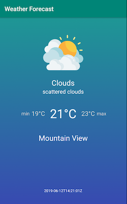
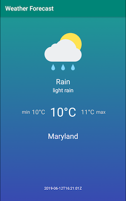
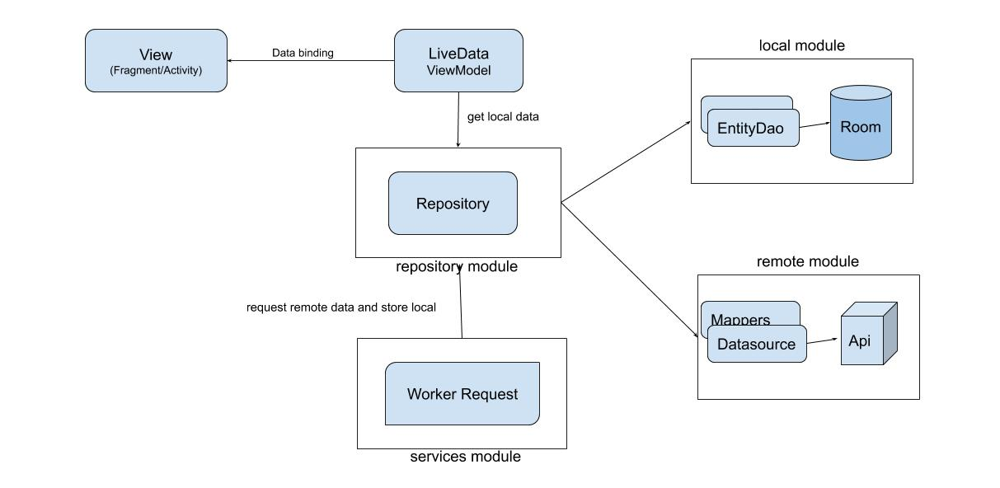

# Weather Forecast app (multi-modules & MVVM & Data binding)

  
## Library Decisions

*   **RxJava**: Async tasks in an easy way to apply operators over the results and enables to make use of other libraries such as RxLocation & RxPermissions.
*   **Retrofit**: most well-known used HTTP client in Android community with RxJava support
*   **Mockk**: I took the opportunity to learn and use mockk rather mockito, it’s a kotlin way to mock things for unit tests.
*   **Koin**: Kotlin dependency injection, simpler and less code than Dagger:
[https://medium.com/@farshidabazari/android-koin-with-mvvm-and-retrofit-e040e4e15f9d](https://medium.com/@farshidabazari/android-koin-with-mvvm-and-retrofit-e040e4e15f9d)

*   **RxPermissions**: Reactive implementation of permission requests: To be more productive
*   **RxLocation**: Reactive implementation of device’s location updates: To be more productive
*   **ViewModel**: Manages activity/fragment lifecycles and integrates with android data binding
*   **Room & LiveData**: Android official database integration with other components such LiveData which notifies the Observers every time a record is updated in the database
*   **WorkManager**: Schedule workers tasks to request weather forecast api every 2 hours

  

## System Design Decision

### **Multi-modules**

This approach helps us to have a **low build times**, **manage code in large teams** and to **reuse code/module across apps**. More details:

* [https://medium.com/google-developer-experts/modularizing-android-applications-9e2d18f244a0](https://medium.com/google-developer-experts/modularizing-android-applications-9e2d18f244a0)

* [https://medium.com/androiddevelopers/a-patchwork-plaid-monolith-to-modularized-app-60235d9f212e](https://medium.com/androiddevelopers/a-patchwork-plaid-monolith-to-modularized-app-60235d9f212e)

  

### MVVM

Because the view has to react to every database change (new weather forecast data update), I chose MVVM with Android Components LiveData, ViewModel and Data Binding, making it more reactive.

  

### Cache Strategy

* In services module, **RefreshWeatherForecastWorker** accomplish the task to request to server a fresh weather forecast data every 2 hours, by accessing the **WeatherRepository.refreshWeatherForecast**.

* In repository module, **WeatherRepository** once has the response from server, saves the fresh weather forecast data into **local database (local module)**.

* In the main module (app), the **MainFragment** holds an instance of a ViewModel with a LiveData provided by the **repository**, which every database changes the LiveData is notified and the view reacts by updating the layout (data binding). 

* **In simples words, the View only listens to the Local Data and the Worker is responsible to request the Remote Data, this strategy keeps the flow simple and the view doesn’t need to control two different streams (remote and local database).**

### Project divided in modules

#### data:
* **model**: model classes
* **remote**: remote data - server api
* **local**: local database
* **repository**: provide a local api to the app and contains the logic to unbundle and cache server’s response

#### services:
* **services**: Schedule worker to execute refresh task periodically to get a fresh data from server

#### common_test:
* **common_test**: Shared utils classes with different modules

#### app:
* **app**: features

 
 

  

## TO DO / IMPROVE / RELEASE

*   Create Boot Completed Broadcast receiver to schedule the work to refresh weather.
*   No connection and error handling when server api is requested
*   Export env variables (endpoint and apikey) and create other build flavours (debug, release, automation, etc…)
*   Create UI tests with Espresso
*   Configure Proguard
*   Add CI system (like Travis or Circle CI)
*   Set Firebase Analytics
*   Firebase Remote Config (for feature flags)
  

  

## Other notes

Make sure your emulator has a new version of Google Play Services, because the project depends on a new Firebase’s version. To update an emulator with the latest Google play services:

[https://stackoverflow.com/questions/35476182/updating-google-play-services-in-emulator](https://stackoverflow.com/questions/35476182/updating-google-play-services-in-emulator)

